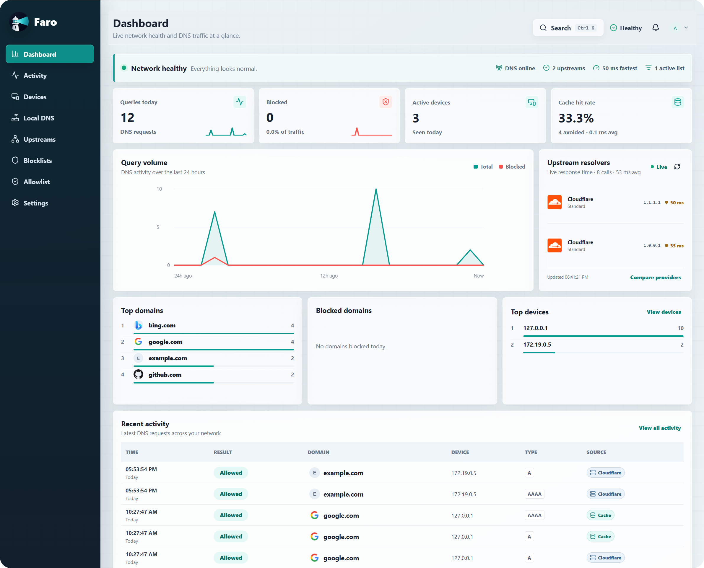

<p align="center">
  
</p>

<h1 align="center">Faro</h1>

<p align="center">
  Friendly, self-hosted DNS control and network visibility for your homelab.
</p>

Faro pairs CoreDNS with an approachable web app so you can understand and control DNS activity without sending your network data to a third party.

<p align="center">
  
</p>

<p align="center">
  <sub>Your network health, DNS activity, and devices&mdash;all in one place.</sub>
</p>

## Features

- Guided first-run setup and local administrator authentication
- Live dashboard and searchable network activity
- Device inventory, friendly names, and activity replay
- Local, read-only UniFi integration for stable device identity across IP changes
- Home protection plus custom per-device protection setups
- Local DNS records, per-protection exceptions, and curated blocklists
- Upstream DNS selection with live latency comparisons
- DNS cache and upstream-resolution visibility
- Clear explanations for why requests were allowed or blocked
- Configurable retention, database pruning, and health metrics
- Downloadable, passphrase-encrypted database backups with in-app restore

## Run Faro

You need Docker Compose and a machine with a fixed LAN IP or DHCP reservation.

```sh
mkdir faro && cd faro
curl -LO https://raw.githubusercontent.com/derek-diaz/Faro/main/docker-compose.yml
docker compose up -d
```

On Windows PowerShell, download the file with:

```powershell
New-Item -ItemType Directory faro -Force | Out-Null
Set-Location faro
Invoke-WebRequest https://raw.githubusercontent.com/derek-diaz/Faro/main/docker-compose.yml -OutFile docker-compose.yml
docker compose up -d
```

Open `http://YOUR-FARO-IP:1787` and create the administrator account. First-run setup remains open until that account is created, then Faro closes account creation automatically. Complete the guided setup, then configure your router's DHCP DNS server to use `YOUR-FARO-IP`.

| Port | Protocol | Purpose |
| --- | --- | --- |
| `1787` | TCP | Faro web interface |
| `53` | TCP and UDP | DNS for your router and devices |

> Port `53` must be available on the Docker host for normal router-wide DNS use.

## Update Faro

Run these commands from the directory containing `docker-compose.yml`:

```sh
docker compose pull
docker compose up -d
```

For port customization, verification, troubleshooting, backups, local development, architecture, and release publishing, see the [technical and deployment guide](docs/README.md).

### Unraid

Unraid runs the same `tabierto/faro` image as standard Docker Compose. The Community Applications template only translates Faro's normal ports, volume, and environment settings into the Unraid interface. See the [Unraid installation notes](docs/unraid.md).

## License

Copyright 2026 Derek Diaz Correa.

Licensed under the Apache License, Version 2.0. See [LICENSE](LICENSE) for the full license text.

<p align="center">
  Made in Puerto Rico.
</p>
