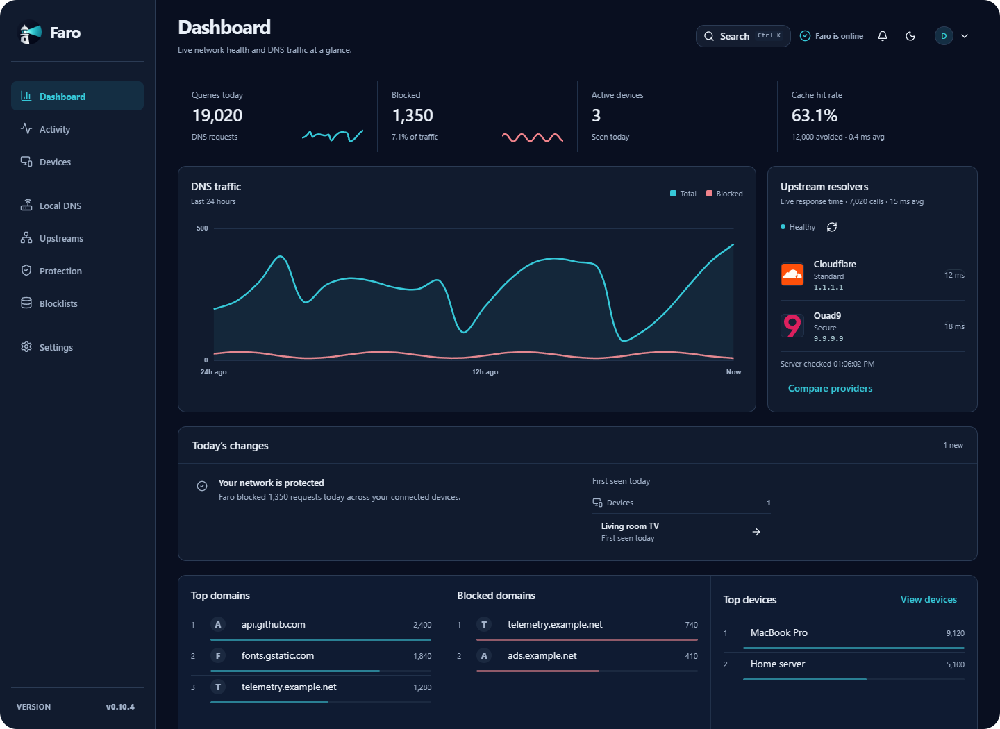
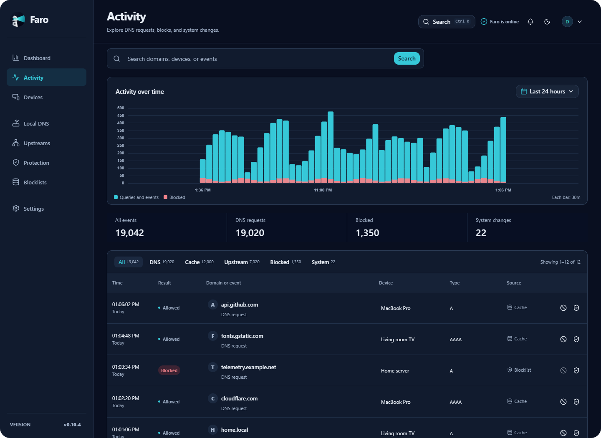
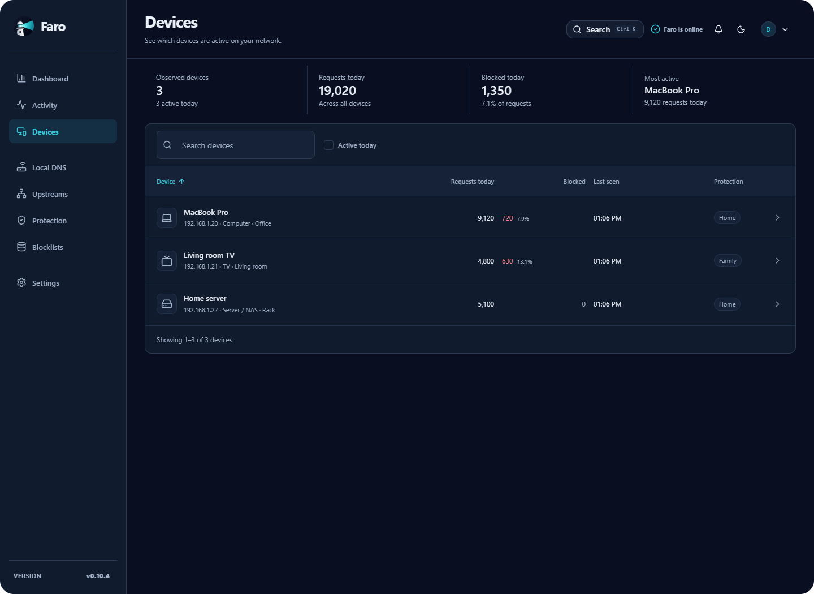

<p align="center">
  
</p>

<h1 align="center">Faro</h1>

<p align="center">
  Understand and protect your network with self-hosted DNS.
</p>

<p align="center">
  <a href="#get-started">Get started</a> ·
  <a href="#explore-faro">Screenshots</a> ·
  <a href="docs/README.md">Documentation</a> ·
  <a href="docs/unraid.md">Unraid</a>
</p>

Faro shows which devices are requesting domains, what gets blocked, and why. Run it on your own hardware to block unwanted domains, investigate network activity, and manage DNS from one web interface.

Your DNS history and configuration are stored locally. No cloud account is required. Faro uses **CoreDNS** to answer DNS requests and forwards requests it cannot answer locally to your chosen upstream DNS provider.

[](docs/screenshots/dashboard.png)

*Current interface, captured September 2026 with example data. Click any screenshot to view it at full size.*

## What you can do

- **See what is happening.** Follow live activity, search domains and devices, and see why a request was allowed or blocked.
- **Choose protection for your household.** Apply blocklists across your network or create per-device protection setups with schedules and exceptions.
- **Get to know your devices.** Give them friendly names, replay their activity, and optionally connect a local UniFi controller for device identification.
- **Manage DNS in one place.** Add local names for your servers, compare upstream providers, and use encrypted DNS-over-HTTPS with health checks and failover.
- **Keep control of your data.** Set history retention, download encrypted backups, and restore them from the interface.
- **Add a second DNS server.** Pair read-only replicas with a primary Faro server for DNS redundancy.

## Get started

You need:

- A machine that stays on, with Docker and Docker Compose installed.
- A fixed local IP address or a DHCP reservation for that machine.
- Port **53 TCP/UDP** available for DNS and port **1787 TCP** for the web interface.
- Access to your router's DNS settings, or a device on which you can set DNS manually.

### 1. Start Faro

On Linux or macOS:

```sh
mkdir faro && cd faro
curl -LO https://raw.githubusercontent.com/derek-diaz/Faro/main/docker-compose.yml
docker compose up -d
```

<details>
<summary>Windows PowerShell</summary>

```powershell
New-Item -ItemType Directory faro -Force | Out-Null
Set-Location faro
Invoke-WebRequest https://raw.githubusercontent.com/derek-diaz/Faro/main/docker-compose.yml -OutFile docker-compose.yml
docker compose up -d
```

</details>

Using Unraid? Follow the [Unraid installation notes](docs/unraid.md).

### 2. Complete setup

Open **`http://YOUR-FARO-IP:1787`** in your browser, replacing `YOUR-FARO-IP` with the machine's local IP address. For example: `http://192.168.1.10:1787`.

Create your administrator account and follow the guided setup to choose upstream DNS providers and protection. Account creation closes automatically after the first administrator is created.

### 3. Point your devices to Faro

Set your router's **LAN/DHCP DNS server** to Faro's local IP address. The exact setting varies by router. Reconnect your devices or renew their DHCP leases so they receive the new setting.

To try Faro on one device first, set that device's DNS server manually to the same address. Open **Activity** in Faro and browse a few sites to check that requests appear.

```text
Your devices → Faro → Your chosen upstream DNS provider
               │
               └─ Protection, local DNS, cache, and activity history
```

Faro only sees DNS requests sent through it. Devices using their own DNS service may bypass it. DNS blocking works on domains; it does not remove every ad or show the contents of visited pages.

If requests do not appear, see [installation checks](docs/installation.md#4-check-dns) and [troubleshooting](docs/troubleshooting.md).

## Explore Faro

### Activity: understand each request

Search domains, devices, and events. Use the timeline and filters to investigate blocks, cached answers, and requests sent upstream.

[](docs/screenshots/activity.png)

### Devices: see who is using your network

See each device's activity, blocked requests, and assigned protection. Select a device to inspect its domains and history or investigate a broken site.

[](docs/screenshots/devices.png)

*All screenshots use synthetic device names and DNS activity, not a real household's history.*

## Update Faro

From the folder containing `docker-compose.yml`, run:

```sh
docker compose pull
docker compose up -d
```

The default configuration follows the `latest` image. Your settings and history persist in the `faro-config` Docker volume. Faro also creates a database backup before applying a schema upgrade.

For version pinning, rollback, and failed upgrades, see [database upgrades and recovery](docs/updates.md#if-faro-fails-after-an-update). You can also download a passphrase-encrypted backup from Faro's interface before updating.

## Documentation

| I want to… | Guide |
| --- | --- |
| Change ports, settings, or deployment options | [Configuration](docs/configuration.md) |
| Install on Unraid | [Unraid setup](docs/unraid.md) |
| Investigate a site that stopped working | [Fix a broken site](docs/fix-a-site.md) |
| Connect UniFi for device identification | [UniFi integration](docs/unifi.md) |
| Run more than one Faro server | [DNS redundancy](docs/redundancy.md) |
| Manage storage, backups, and recovery | [Persistent data](docs/backup-restore.md) |
| Run from source or understand the backend | [Local development](docs/development.md) and [architecture](docs/architecture.md) |

## License

Copyright 2026 Derek Diaz Correa. Licensed under the [Apache License, Version 2.0](LICENSE).

<p align="center">Made in Puerto Rico.</p>
